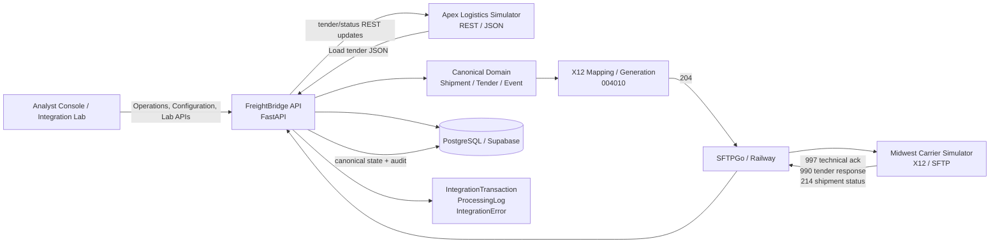
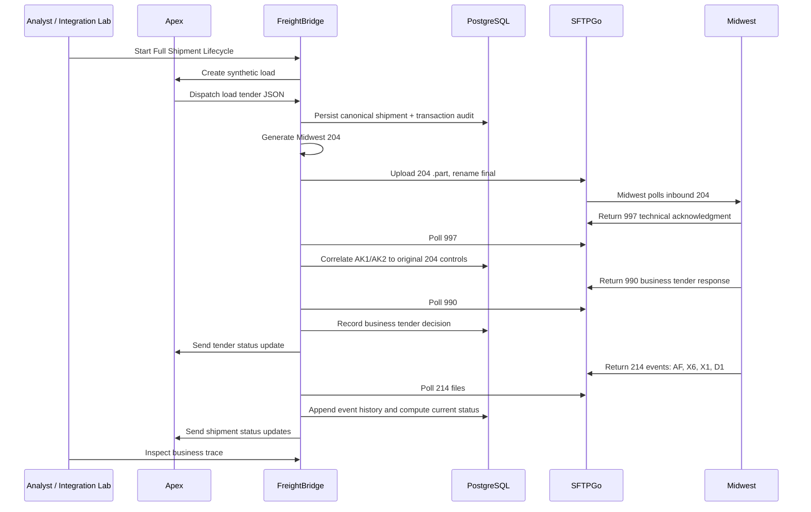

# FreightBridge

[](https://github.com/Ryandeboss/FreightBridge/actions/workflows/ci.yml)

FreightBridge is a synthetic logistics integration platform that translates between a modern REST/JSON broker and an X12 004010 carrier. It demonstrates canonical shipment mapping, SFTP transport, technical and business acknowledgments, idempotency, retry, transaction observability, partner configuration, an Analyst Console, and an Integration Lab for happy-path and controlled-failure demos.

FreightBridge now has two authenticated experiences: Training Mode for guided, story-driven integration learning, and the Advanced Analyst Console for direct operational exploration. Milestone 23 implements Training Home and Mission 1, "Learn the Flow"; future troubleshooting missions are shown only as locked or coming-soon placeholders.

This is a portfolio lab, not a production TMS. Apex Logistics and Midwest Carrier are fictional trading partners created for the project. The architecture and failure modes are modeled after real EDI/API integration work, but no real customer or partner data is involved.

## MVP Status

FreightBridge's MVP scope is complete through Milestone 22 final deployed acceptance. The final gate verifies deployed readiness, runs the Milestone 20 happy-path and failure-drill regression pack, and rechecks postflight health without adding Phase 2 functionality.

## What It Demonstrates

- REST/JSON ingestion from a synthetic broker/3PL partner.
- Canonical shipment modeling between partner-specific contracts.
- Generic X12 parsing, validation, and serialization separate from business mapping.
- Midwest X12 004010 transaction sets: `204`, `997`, `990`, and `214`.
- SFTP exchange through SFTPGo with host-key verification, archive/error routing, and atomic upload/rename.
- Bearer-token protected partner and operations APIs.
- Idempotency-key replay, business duplicate detection, and stored-payload manual retry.
- Versioned partner mapping profiles and runtime mapping audit metadata.
- IntegrationTransaction, ProcessingLog, IntegrationError, business trace, and failure queue observability.
- Analyst Console screens for dashboard, transactions, failures, trace, partners, mappings, and Integration Lab.
- Controlled failure injection for troubleshooting demos.
- Automated regression testing with contract, X12, UI, real PostgreSQL, and deployed acceptance layers.

One important EDI concept is intentionally visible throughout the project: `997` is a technical functional acknowledgment that says an EDI document was syntactically received, while `990` is the business tender decision that accepts or rejects a load. FreightBridge records those separately so a technically accepted `204` does not accidentally become a business-accepted tender.

## Architecture



More detail: [portfolio architecture](docs/portfolio/architecture.md), [end-to-end flow](docs/portfolio/end-to-end-flow.md), and [technical decisions](docs/portfolio/technical-decisions.md).

## Successful Lifecycle



## Portfolio Reading Path

- [Portfolio overview](docs/portfolio/README.md)
- [Architecture](docs/portfolio/architecture.md)
- [End-to-end flow](docs/portfolio/end-to-end-flow.md)
- [Troubleshooting case study](docs/portfolio/troubleshooting-case-study.md)
- [Evidence index](docs/portfolio/evidence.md)
- [Final MVP summary](docs/portfolio/final-mvp-summary.md)
- [Demo script](docs/portfolio/demo-script.md)
- [Interview guide](docs/portfolio/interview-guide.md)
- [Full documentation index](docs/README.md)

## Testing Story

Coverage gates complement contract, integration, database, frontend, and deployed acceptance tests. Current normal CI includes:

- Frontend lint, Vitest coverage, and production build.
- FreightBridge API, Apex simulator, and Midwest simulator pytest suites with coverage gates.
- REST/API contract tests for stable FastAPI route and response surfaces.
- Apex documented-contract checks against `docs/partners/apex/openapi.yaml`.
- X12 regression tests for 204, 997, 990, and 214 behavior.
- Ephemeral PostgreSQL 16 validation that applies migrations `001` through `011` from scratch, verifies schema/seed data, and runs real repository tests.
- Acceptance harness unit tests.
- Documentation link validation.

Accepted Milestone 20 coverage evidence was approximately:

- FreightBridge API: 76.62%
- Apex simulator: 85.80%
- Midwest simulator: 72.94%
- Analyst UI line coverage: 73.22%

Deployed regression is manual `workflow_dispatch` because it mutates shared synthetic test data. Milestone 20 runs the Milestone 18 full happy path and then the Milestone 19 controlled failure drills.

## Repository Map

```text
apps/analyst-ui/              React + TypeScript Analyst Console
services/freightbridge-api/   FastAPI integration and operations API
services/apex-partner-sim/    Synthetic Apex REST/JSON partner simulator
services/midwest-partner-sim/ Synthetic Midwest X12 partner simulator
docs/                         Portfolio, architecture, partner, operations, and testing docs
infrastructure/supabase/      PostgreSQL migrations 001-011
infrastructure/railway/       SFTPGo/Railway setup notes
sample-data/                  Synthetic Apex JSON and Midwest X12 fixtures
scripts/acceptance/           Deployed acceptance harnesses
scripts/ci/                   CI helpers including migration and docs validation
```

## Local Development

Frontend:

```bash
cd apps/analyst-ui
npm install
npm run lint
npm run test
npm run build
npm run dev
```

FreightBridge API:

```bash
cd services/freightbridge-api
python -m venv .venv
.venv\Scripts\activate
pip install -r requirements.txt
python -m pytest
uvicorn app.main:app --reload
```

Apex simulator:

```bash
cd services/apex-partner-sim
python -m venv .venv
.venv\Scripts\activate
pip install -r requirements.txt
python -m pytest
uvicorn app.main:app --reload
```

Midwest simulator:

```bash
cd services/midwest-partner-sim
python -m venv .venv
.venv\Scripts\activate
pip install -r requirements.txt
python -m pytest
uvicorn app.main:app --reload
```

Documentation validation:

```bash
python scripts/ci/validate_docs.py
python -m unittest discover scripts/ci/tests
```

## Sample Data

- Apex JSON fixtures: [sample-data/json/apex](sample-data/json/apex/)
- Midwest X12 fixtures: [sample-data/x12/midwest](sample-data/x12/midwest/)
- Midwest mapping requirements: [docs/mappings](docs/mappings/README.md)
- Partner contracts: [docs/partners](docs/partners/README.md)

## Security And Boundaries

Partner credentials stay server-side. The frontend never receives partner bearer tokens, SFTP credentials, database URLs, or private keys. The operations token is entered at runtime by an authorized user and stored only in browser session storage. SFTP host keys are pinned, private keys remain server-side, and normal CI uses local processes plus an ephemeral PostgreSQL service rather than deployed production infrastructure.

## Implemented Vs Deferred

Implemented:

- Apex REST/JSON load tender ingestion.
- Canonical shipment, tender, and event persistence.
- Midwest X12 204 generation and SFTP delivery.
- Midwest 997 technical acknowledgment processing.
- Midwest 990 tender response processing.
- Midwest 214 shipment event processing.
- Operations observability, failure queue, business trace, manual retry, partner configuration, mapping versioning, Analyst Console, Integration Lab, and regression hardening.

Deferred / future:

- 210 Freight Invoice.
- SOAP/XML third partner.
- AS2 and MDN.
- X12 999 and TA1.
- Broad arbitrary graphical mapping designer.
- Full production environment promotion and change-management workflow.

## Known Limitations

FreightBridge is intentionally scoped as a portfolio lab. It uses synthetic partners, supports a limited project-specific X12 004010 profile, and demonstrates production-style integration concerns without claiming full X12 standard coverage or production readiness.
