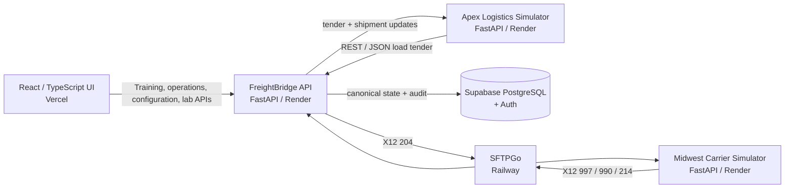

# FreightBridge

> **A full-stack EDI/API logistics integration simulator and analyst-training platform.**  
> FreightBridge models how a modern REST/JSON logistics partner can exchange shipment data with an X12 EDI carrier while preserving mapping, correlation, observability, retry, and troubleshooting workflows.

[](https://freightbridge-app.vercel.app/)
[](https://github.com/Ryandeboss/FreightBridge/actions/workflows/ci.yml)

**Live app:** https://freightbridge-app.vercel.app/

FreightBridge is a portfolio lab built to learn and demonstrate the core work behind **EDI/API integration engineering** in logistics. It combines a deployed integration system, operational analyst tooling, controlled failure scenarios, and a guided training course in one application.

Apex Logistics and Midwest Carrier are fictional trading partners. No real customer or partner data is used.

---

## Why I Built It

Logistics integrations rarely live in one technology stack.

A broker or 3PL may expose a modern **REST API with JSON**, while a carrier may exchange **X12 EDI files over SFTP**. The difficult part is not simply converting one format into another. Integration engineers also have to deal with:

- partner-specific field names and business rules;
- transport differences between synchronous APIs and asynchronous file exchange;
- X12 envelopes, control numbers, and version compatibility;
- shipment and transaction correlation;
- technical acknowledgments versus business decisions;
- idempotency, duplicate submissions, and exact-message replay;
- out-of-order shipment events;
- mapping changes and partner-specific configuration;
- observability when a message fails halfway through a multi-system flow.

**FreightBridge models those problems end to end.**

---

## The Scenario

FreightBridge sits between two synthetic logistics partners:

| System | Role | Integration style |
| --- | --- | --- |
| **Apex Logistics** | Broker / 3PL-style partner | REST API + JSON |
| **FreightBridge** | Integration middleware | Canonical model, mapping, routing, observability |
| **Midwest Carrier** | Motor-carrier-style partner | X12 004010 + SFTP |

A normal shipment moves through the system like this:

```text
Apex Logistics
REST / JSON load tender
        ↓
FreightBridge
Authenticate → Validate → Canonicalize → Map → Audit
        ↓
X12 204 over SFTP
        ↓
Midwest Carrier

Midwest → 997 technical acknowledgment
Midwest → 990 tender response
Midwest → 214 shipment status events

        ↓
FreightBridge correlates and normalizes the responses
        ↓
Apex receives tender and shipment-status updates
```

One distinction is intentionally emphasized throughout the project:

- **997** = technical / functional acknowledgment of the EDI transaction.
- **990** = business decision accepting or rejecting the load.

A technically acknowledged 204 is not automatically a business-accepted tender.

---

## What You Can Do In The Live App

### 1. Learn the integration flow

The public learner experience introduces the three-company relationship before moving into an authenticated course.

The completed course contains:

- **7 modules**
- **10 missions**
- First-Day Orientation
- EDI & Protocol Basics
- Healthy Integration walkthrough
- Guided Troubleshooting
- Advanced Incidents
- Independent Investigation
- Final Shift
- Course Completion
- post-course **Free Practice**

Learner accounts use **Supabase Auth**, and course progress is persisted server-side so a learner can sign in again and continue from another browser.

### 2. Run integrations

The **Integration Lab** can execute healthy shipment scenarios and controlled failures against the deployed backend services.

Examples include:

- full shipment lifecycle;
- technical acknowledgment only;
- accepted or rejected tender;
- authentication failure;
- malformed JSON;
- contract validation failure;
- duplicate shipment attempt;
- X12 control mismatch;
- unsupported status mapping;
- wrong X12 version;
- SFTP trust failure;
- unknown shipment reference.

### 3. Investigate what happened

The Advanced Analyst Console includes:

- Dashboard
- Transactions
- Transaction Detail
- Business Trace
- Failures
- Failure Detail
- Partner Profiles
- Mapping Profiles
- Integration Lab

The goal is to answer questions such as:

> What did FreightBridge receive?  
> How far did processing get?  
> What was the last healthy checkpoint?  
> Which boundary failed?  
> What evidence proves the root cause?  
> Did the correction actually restore the customer-facing outcome?

---

## Quick Demo Path

If you are reviewing the project from a portfolio or LinkedIn post, this is the fastest path through the strongest parts of the application.

| Step | Route | What to look for |
| --- | --- | --- |
| 1 | [`#/learn`](https://freightbridge-app.vercel.app/#/learn) | Apex → FreightBridge → Midwest product framing |
| 2 | `#/learn/bootcamp` | REST vs JSON, SFTP vs X12, 204 / 997 / 990 / 214 |
| 3 | `#/learn/healthy/workstation` | Healthy JSON → canonical → X12 shipment flow |
| 4 | `#/lab` | Run a full lifecycle or controlled failure |
| 5 | `#/trace/<LOAD_ID>` | Follow one business identifier across transactions |
| 6 | `#/learn/mission/production-incident` | Final Shift: diagnose a valid 214 with the wrong shipment reference |
| 7 | `#/learn/completion` | 10 / 10 missions, 100% completion |
| 8 | `#/learn/free-practice` | Unguided access to the analyst toolset |
| 9 | `#/dashboard` | Full Advanced Analyst Console |

Authenticated routes require a learner account.

---

## Architecture


```mermaid
flowchart LR
  UI[React / TypeScript UI<br/>Vercel]
  Apex[Apex Logistics Simulator<br/>FastAPI / Render]
  FB[FreightBridge API<br/>FastAPI / Render]
  DB[(Supabase PostgreSQL<br/>+ Auth)]
  SFTP[SFTPGo<br/>Railway]
  Midwest[Midwest Carrier Simulator<br/>FastAPI / Render]

  UI -->|Training, operations, configuration, lab APIs| FB
  Apex -->|REST / JSON load tender| FB
  FB -->|canonical state + audit| DB
  FB -->|X12 204| SFTP
  SFTP --> Midwest
  Midwest -->|X12 997 / 990 / 214| SFTP
  SFTP --> FB
  FB -->|tender + shipment updates| Apex
```

### Core system boundaries

**REST / JSON side**
- synchronous API requests;
- bearer-token authentication;
- JSON parsing and contract validation;
- partner-specific Apex mapping.

**Canonical domain**
- shipment;
- locations and stops;
- references;
- tender response;
- shipment events;
- integration transactions;
- processing logs;
- integration errors.

**X12 / SFTP side**
- X12 004010 parsing and serialization;
- 204 Load Tender;
- 997 Functional Acknowledgment;
- 990 Tender Response;
- 214 Shipment Status;
- SFTP transport, host-key verification, archive/error routing, and atomic upload/rename.

---

## Engineering Highlights

| Integration problem | FreightBridge approach |
| --- | --- |
| Partner contracts do not match | Normalize partner payloads into a stable canonical model |
| X12 structure and business meaning are different concerns | Keep the generic parser separate from partner-specific mapping |
| Technical success can be mistaken for business success | Store 997 acknowledgment separately from 990 tender decision |
| Retries can create duplicate business work | Distinguish idempotent replay from duplicate shipment attempts |
| Exact X12 files can be received more than once | Retain replay/audit evidence while skipping duplicate side effects |
| Shipment events can arrive out of order | Preserve event history while using business event time to determine current status |
| Partner mappings change | Use versioned mapping profiles with draft, validation, activation, and audit history |
| Multi-system failures are difficult to diagnose | Persist transaction, processing-log, error, mapping, and correlation evidence |
| Transport failures may happen before a transaction exists | Treat SFTP trust/connectivity as its own observable boundary |
| Training can become disconnected from real behavior | Run guided scenarios against the same APIs and integration logic used by the Advanced Console |

---

## Training Mode

Training Mode is designed around one principle:

> **Never show the learner a tool before they understand why they need it.**

The learner begins with the business story and gradually moves toward real operational tooling.

```text
01 Orientation
      ↓
02 EDI & Protocol Basics
      ↓
03 Healthy Integration
      ↓
04 Guided Troubleshooting
      ↓
05 Advanced Incidents
      ↓
06 Independent Investigation
      ↓
07 Final Shift
      ↓
Course Completion → Free Practice
```

Advanced labs use a reusable:

**CONSOLE | CODE | ANSWER**

workstation so the learner can inspect evidence, understand configuration, form a diagnosis, apply a controlled correction, and verify recovery.

The Final Shift removes most of the earlier hand-holding. The learner investigates a technically valid Midwest 214 that reaches business validation but references the wrong shipment, then proves the corrected Apex-facing result.

---

## Observability And Troubleshooting

FreightBridge records operational evidence instead of treating integration failures as opaque exceptions.

### `IntegrationTransaction`
Tracks the message or integration operation being processed.

### `ProcessingLog`
Records stage-by-stage progress through the integration pipeline.

### `IntegrationError`
Stores safe diagnostic information such as:

- stage;
- category;
- error code;
- retryability;
- human-readable message.

### Business Trace
Correlates transactions and relationships around a business identifier such as a shipment or load.

This makes it possible to distinguish failures at boundaries such as:

```text
Authentication
→ Parsing
→ Contract Validation
→ Canonical Mapping
→ X12 Controls
→ Partner Profile
→ Status Mapping
→ Business Correlation
→ Downstream Update
```

---

## Technology Stack

| Layer | Technology |
| --- | --- |
| Frontend | React, TypeScript, Vite |
| Frontend deployment | Vercel |
| Integration API | Python, FastAPI |
| Partner simulators | Python, FastAPI |
| Backend deployment | Render |
| Database | PostgreSQL / Supabase |
| Authentication | Supabase Auth |
| SFTP environment | SFTPGo on Railway |
| EDI | X12 004010 |
| Testing | Vitest, pytest, PostgreSQL regression tests |
| CI | GitHub Actions |

---

## Testing And Quality

Normal CI validates the project across multiple layers:

- frontend lint, tests, coverage, and production build;
- FreightBridge API tests;
- Apex simulator tests;
- Midwest simulator tests;
- REST/API contract checks;
- X12 regression behavior;
- PostgreSQL migration-chain regression;
- acceptance-harness unit tests;
- documentation validation.

The database regression job creates a fresh PostgreSQL environment and applies migrations **001 through 012** before running repository tests.

Deployed end-to-end acceptance is kept separate because it mutates the shared synthetic environment.

---

## Repository Structure

```text
apps/analyst-ui/              React + TypeScript learner and analyst UI
services/freightbridge-api/   FastAPI integration, operations, config, and lab API
services/apex-partner-sim/    Synthetic REST/JSON broker/3PL simulator
services/midwest-partner-sim/ Synthetic X12/SFTP carrier simulator

infrastructure/supabase/      PostgreSQL migrations
infrastructure/railway/       SFTPGo / Railway setup
sample-data/                  Synthetic JSON and X12 fixtures

scripts/acceptance/           Deployed acceptance harness
scripts/ci/                   CI and migration helpers
docs/                         Architecture, mappings, partner guides, runbooks, portfolio docs
```

---

## Explore The Engineering Details

For reviewers who want to go deeper:

- [Architecture](docs/portfolio/architecture.md)
- [End-to-end shipment flow](docs/portfolio/end-to-end-flow.md)
- [Troubleshooting case study](docs/portfolio/troubleshooting-case-study.md)
- [Technical decisions](docs/portfolio/technical-decisions.md)
- [Evidence index](docs/portfolio/evidence.md)
- [Interview / demo guide](docs/portfolio/demo-script.md)
- [Full documentation index](docs/README.md)

The [evidence index](docs/portfolio/evidence.md) maps major portfolio claims to the implementation, tests, and documentation that support them.

---

## Security And Scope

FreightBridge is intentionally a **portfolio lab, not a production TMS or commercial EDI platform**.

- Apex Logistics and Midwest Carrier are fictional.
- All shipment data is synthetic.
- Partner credentials and private SFTP material stay server-side.
- The frontend does not receive partner bearer tokens, private keys, or database URLs.
- SFTP host keys are pinned at the transport boundary.
- The project demonstrates a scoped X12 004010 implementation rather than claiming full X12-standard coverage or production certification.

### Implemented

- REST/JSON load-tender ingestion
- canonical shipment mapping
- X12 204 generation
- SFTP delivery
- 997 acknowledgment processing
- 990 tender-response processing
- 214 shipment-status processing
- idempotency and replay handling
- event-time shipment progression
- transaction observability
- failure queue and business trace
- retry workflows
- partner configuration
- versioned mapping profiles
- controlled failure injection
- Integration Lab
- learner accounts and persistent course progress
- completed 10-mission training course
- course completion and Free Practice

### Possible future extensions

- X12 210 Freight Invoice
- AS2 / MDN
- X12 999 / TA1
- SOAP/XML partner
- broader mapping-designer tooling
- production-grade environment promotion and change management

---

<details>
<summary><strong>Local development</strong></summary>

### Frontend

```bash
cd apps/analyst-ui
npm install
npm run lint
npm run test
npm run build
npm run dev
```

### FreightBridge API

```bash
cd services/freightbridge-api
python -m venv .venv
.venv\Scripts\activate
pip install -r requirements.txt
python -m pytest
uvicorn app.main:app --reload
```

### Apex simulator

```bash
cd services/apex-partner-sim
python -m venv .venv
.venv\Scripts\activate
pip install -r requirements.txt
python -m pytest
uvicorn app.main:app --reload
```

### Midwest simulator

```bash
cd services/midwest-partner-sim
python -m venv .venv
.venv\Scripts\activate
pip install -r requirements.txt
python -m pytest
uvicorn app.main:app --reload
```

### Documentation validation

```bash
python scripts/ci/validate_docs.py
python -m unittest discover scripts/ci/tests
```

</details>

---

## Project Goal

FreightBridge is meant to demonstrate more than the ability to build pages or APIs.

The goal is to show how I approach a system where **multiple partners, protocols, document formats, business rules, and failure boundaries have to work together** — and how I make that system observable enough for another person to understand, troubleshoot, and learn from.
