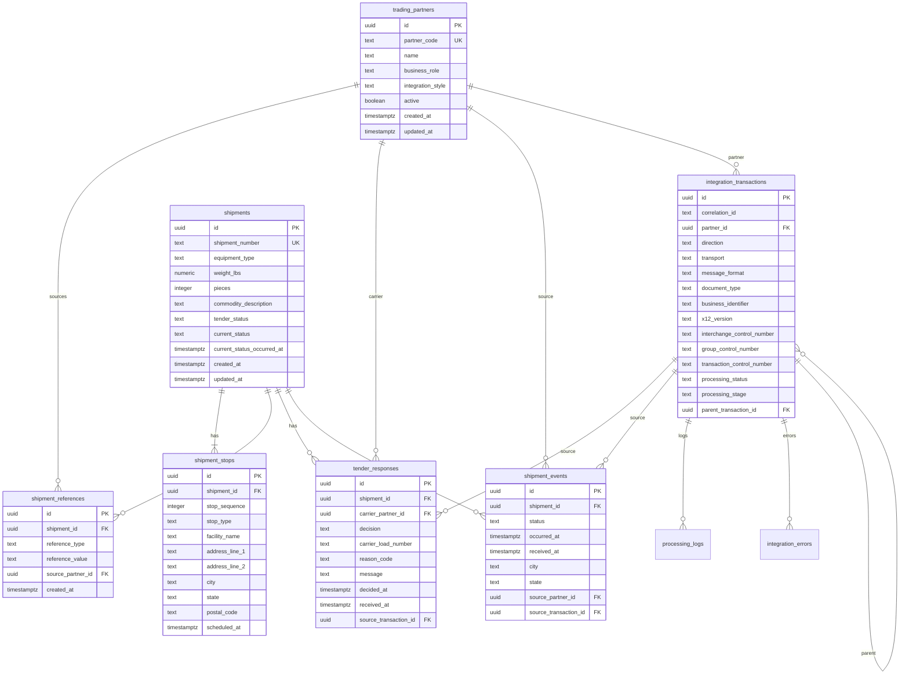

# Database Schema

Milestone 4 introduces the FreightBridge domain schema. It is created by:

`infrastructure/supabase/migrations/20260920_001_create_freightbridge_domain.sql`

The schema uses PostgreSQL tables, constraints, indexes, and idempotent seed rows for synthetic trading partners. It does not store secrets or raw payload bodies.

## Entity Relationship Diagram

## Major Constraints

- Known enum-like values are constrained with `CHECK` constraints.
- `shipment_number` and `partner_code` are unique.
- Shipment references prevent duplicate `(shipment_id, reference_type, reference_value)` rows.
- Stops require positive sequence numbers and known stop types.
- Tender rejections require a reason code.
- REST transactions must use JSON; SFTP transactions must use X12 for the MVP schema.

## Major Indexes

- `partner_code`
- `shipment_number`
- `shipments.current_status`
- shipment/event foreign keys
- `shipment_events.occurred_at`
- transaction `correlation_id`
- transaction `business_identifier`
- transaction processing status
- X12 control numbers for X12 transactions
- processing log and integration error transaction IDs

## Seed Data

The migration upserts two stable synthetic partners:

- `APEX` - Apex Logistics, `BROKER_3PL`, `REST_JSON`
- `MWCX` - Midwest Carrier, `MOTOR_CARRIER`, `X12_SFTP`

No LOAD500 business data is seeded permanently.
