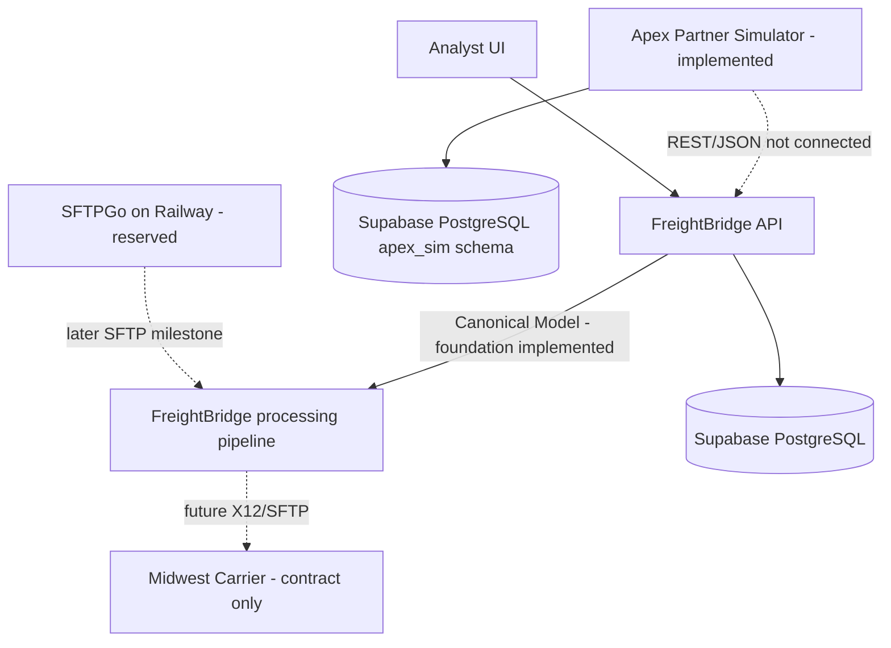

# Initial Architecture

This diagram captures the current FreightBridge direction. Apex is now implemented as an independent REST/JSON simulator, while the Apex-to-FreightBridge connection, mapping, EDI, SFTP, and Midwest simulator behavior remain future work.

## Component Notes

- Apex Partner Simulator: independent synthetic REST/JSON partner backend.
- Analyst UI: React/Vite operational dashboard deployed to Vercel.
- FreightBridge API: FastAPI middleware deployed to Render.
- Supabase PostgreSQL: durable FreightBridge canonical records and, for portfolio cost simplicity, the separate `apex_sim` logical partner schema.
- SFTPGo on Railway: provisioned / reserved for a later public SFTP ingress milestone.
- Midwest Carrier Simulator: future synthetic X12/SFTP destination.
