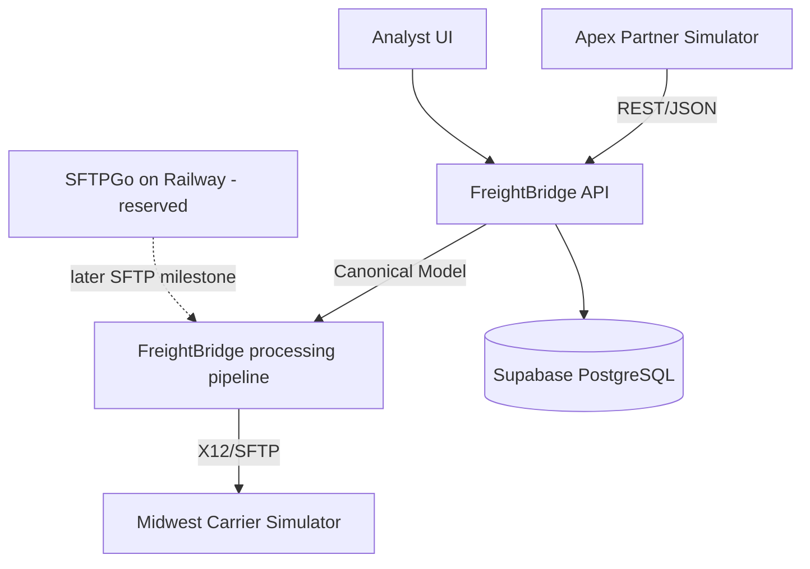

# Initial Architecture

This diagram captures the intended FreightBridge direction without implementing the future EDI, SFTP, mapping, or partner simulator features. Milestone 3 specifies the Apex and Midwest endpoint contracts that will inform the future FreightBridge canonical model.

## Component Notes

- Apex Partner Simulator: future synthetic REST/JSON source.
- Analyst UI: React/Vite operational dashboard deployed to Vercel.
- FreightBridge API: FastAPI middleware deployed to Render.
- Supabase PostgreSQL: durable application data and future canonical records.
- SFTPGo on Railway: provisioned / reserved for a later public SFTP ingress milestone.
- Midwest Carrier Simulator: future synthetic X12/SFTP destination.
