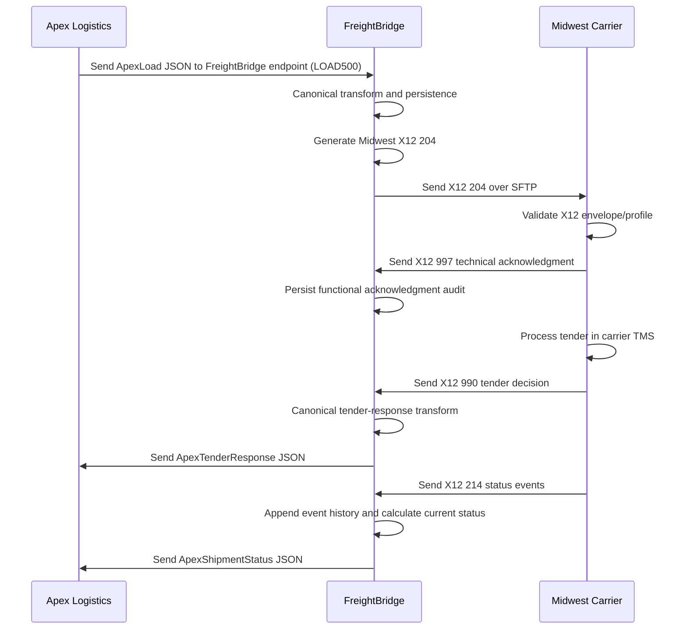

# Interface Control Document

This document defines the relationship between synthetic Apex Logistics, FreightBridge, and synthetic Midwest Carrier. FreightBridge now has canonical persistence, Apex ingestion, generic X12 structure handling, Midwest 204 SFTP delivery, Midwest 997 technical acknowledgment processing, Midwest 990 tender response processing, Midwest 214 shipment-status processing, and Apex callback/readback flows.

```text
Apex Logistics
      |
 REST/JSON
      |
      v
FreightBridge
      |
 X12 / SFTP
      |
      v
Midwest Carrier
```

## System Boundaries

| System | Boundary |
| --- | --- |
| Apex Logistics | Owns Apex REST/JSON contract and broker/TMS identifiers |
| FreightBridge | Owns canonical representation, transformation, routing, correlation, and operational visibility |
| Midwest Carrier | Owns Midwest X12 4010 profile, SFTP directory perspective, and carrier/TMS identifiers |

## Responsibility Matrix

| Responsibility | Apex | FreightBridge | Midwest |
| --- | --- | --- | --- |
| REST JSON contract | Owns Apex `/v1` endpoints and outbound ApexLoad payload | Owns inbound Apex integration endpoint and produces Apex callbacks | Not applicable |
| Canonical model | Not applicable | Owner | Not applicable |
| X12 204 generation | Not applicable | Generates and delivers over SFTP | Receives/validates in simulator |
| X12 990 generation | Receives transformed result | Transforms to canonical tender response | Produces |
| X12 214 generation | Receives transformed result | Transforms to canonical ShipmentEvent | Produces |
| X12 997 handling | Not applicable | Correlates to original outbound 204 and stores technical acknowledgment audit | Produces for received 204 |
| SFTP service | Not applicable | SFTP client/processing owner | SFTP account perspective |
| Credential storage | Stores Apex token out of repo | Stores app secrets out of repo | Stores SSH public key/account data |

## Transport Boundaries

- Apex boundary: HTTPS REST with JSON payloads and bearer-token authentication.
- FreightBridge boundary: API, canonical transformation layer, Midwest 204 generation/delivery, and EDI transport processing.
- Midwest boundary: SFTP file exchange using X12 004010 files.

## Security Boundaries

- Apex bearer tokens are backend-only.
- Midwest SSH keys are backend/SFTP infrastructure secrets only.
- Supabase/database credentials remain backend-only.
- No partner credentials, private keys, or real connection strings belong in source control.

## Expected Message Flows

Current implemented flow:

1. Apex creates/tenders a load using its REST/JSON representation.
2. Apex sends the ApexLoad JSON payload to the FreightBridge-owned inbound endpoint.
3. FreightBridge transforms and persists a canonical shipment.
4. FreightBridge generates and sends the Midwest-specific X12 204 over SFTP.
5. Midwest consumes the 204 and owns a pending load.
6. Midwest generates a 997 technical acknowledgment for the received 204.
7. FreightBridge consumes the 997 and records functional acknowledgment audit without changing tender status.
8. Midwest processes the tender and returns a 990 over SFTP.
9. FreightBridge transforms the tender decision and forwards JSON to Apex.
10. Midwest later sends 214 shipment statuses over SFTP.
11. FreightBridge appends canonical ShipmentEvent history, updates current status using canonical progression, and forwards JSON to Apex.

## Synchronous vs. Asynchronous Behavior

- Apex-owned REST calls are synchronous at the transport level.
- Apex outbound load tender delivery is Apex -> FreightBridge.
- Tender decisions and shipment statuses are FreightBridge -> Apex on the Apex-facing side.
- Midwest SFTP exchanges are asynchronous file drops and pickups.
- 997 is a technical acknowledgment, not a business decision.
- 990 is the business tender response.
- 214 status events are asynchronous after tender acceptance.

## Correlation Concepts

Implementation correlates:

- Apex `loadId`, such as `LOAD500`
- BOL reference, such as `BOL900`
- PO reference, such as `PO111`
- Midwest carrier load number, such as `MWC900500`
- X12 interchange, group, and transaction control numbers
- FreightBridge correlation ID

## Retry and Duplicate Expectations

- Apex REST retries should use idempotent identifiers where possible.
- Midwest file retries should not overwrite existing file names.
- Future full idempotency work should consider both file name/control number and business identifiers.
- Retry ownership depends on the failing layer: caller retries transport failures, FreightBridge handles transformation retries, and partner systems own their processing queues.

## Failure Responsibility by Layer

| Layer | Owner | Example failure |
| --- | --- | --- |
| REST transport | Caller and Apex | Timeout, 401, 503 |
| JSON validation | Apex/FreightBridge contract boundary | Missing destination |
| Canonical transformation | FreightBridge | Mapping cannot represent a required value |
| X12 generation/parsing | FreightBridge | Missing required segment |
| SFTP transport | FreightBridge and Midwest boundary | File upload failure |
| Midwest processing | Midwest | Tender declined, load rejected |

## Environment Assumptions

- Vercel hosts the Analyst UI.
- Render hosts the FreightBridge API.
- Supabase hosts PostgreSQL.
- Railway/SFTPGo hosts the Midwest SFTP exchange.
- All current partner documents and fixtures are synthetic.

## Future Happy Path


