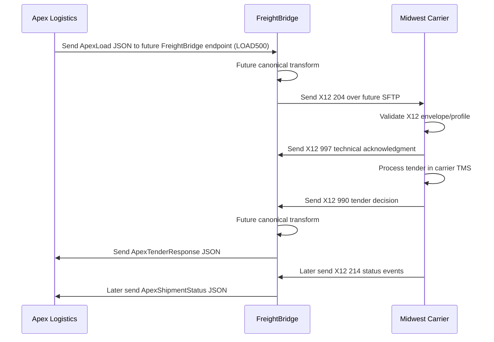

# Interface Control Document

This document defines the planned relationship between synthetic Apex Logistics, FreightBridge, and synthetic Midwest Carrier. It is documentation only; no canonical model, mapping engine, EDI parser, SFTP client, simulator, or transaction processing is implemented in this milestone.

```text
Apex Logistics
      |
 REST/JSON
      |
      v
FreightBridge
      |
 X12 / SFTP
      |
      v
Midwest Carrier
```

## System Boundaries

| System | Boundary |
| --- | --- |
| Apex Logistics | Owns Apex REST/JSON contract and broker/TMS identifiers |
| FreightBridge | Owns future canonical representation, transformation, routing, correlation, and operational visibility |
| Midwest Carrier | Owns Midwest X12 4010 profile, future SFTP directories, and carrier/TMS identifiers |

## Responsibility Matrix

| Responsibility | Apex | FreightBridge | Midwest |
| --- | --- | --- | --- |
| REST JSON contract | Owns Apex `/v1` endpoints and outbound ApexLoad payload | Owns future inbound Apex integration endpoint and produces future Apex callbacks | Not applicable |
| Canonical model | Not applicable | Future owner | Not applicable |
| X12 204 generation | Not applicable | Future owner | Receives/validates |
| X12 990 generation | Receives transformed result | Future transform owner | Produces |
| X12 214 generation | Receives transformed result | Future transform owner | Produces |
| X12 997 handling | Not applicable | Future processing owner | Produces for received 204 |
| SFTP service | Not applicable | Future client/processing owner | Future account perspective |
| Credential storage | Stores Apex token out of repo | Stores app secrets out of repo | Stores future SSH public key/account data |

## Transport Boundaries

- Apex boundary: HTTPS REST with JSON payloads and bearer-token authentication.
- FreightBridge boundary: API, future canonical transformation layer, future EDI processing layer.
- Midwest boundary: Future SFTP file exchange using X12 004010 files.

## Security Boundaries

- Apex bearer tokens are backend-only.
- Midwest SSH keys are future backend/SFTP infrastructure secrets only.
- Supabase/database credentials remain backend-only.
- No partner credentials, private keys, or real connection strings belong in source control.

## Expected Message Flows

Initial future flow:

1. Apex creates/tenders a load using its REST/JSON representation.
2. Apex sends the ApexLoad JSON payload to a future FreightBridge-owned inbound endpoint.
3. FreightBridge eventually transforms through a canonical representation.
4. FreightBridge sends a Midwest-specific X12 204 file.
5. Midwest validates receipt and returns a 997.
6. Midwest processes the tender and returns a 990.
7. FreightBridge transforms the tender decision.
8. Apex receives the tender decision as JSON.

Later MVP flow:

1. Midwest sends 214 shipment statuses.
2. FreightBridge transforms status events through the future canonical model.
3. Apex receives shipment status JSON.

## Synchronous vs. Asynchronous Behavior

- Apex-owned REST calls are synchronous at the transport level.
- Apex outbound load tender delivery is Apex -> FreightBridge.
- Tender decisions and shipment statuses are FreightBridge -> Apex on the Apex-facing side.
- Midwest SFTP exchanges are asynchronous file drops and pickups.
- 997 is a technical acknowledgment, not a business decision.
- 990 is the business tender response.
- 214 status events are asynchronous after tender acceptance.

## Correlation Concepts

Future implementation should correlate:

- Apex `loadId`, such as `LOAD500`
- BOL reference, such as `BOL900`
- PO reference, such as `PO111`
- Midwest carrier load number, such as `MWC900500`
- X12 interchange, group, and transaction control numbers
- Future FreightBridge correlation ID

## Retry and Duplicate Expectations

- Apex REST retries should use idempotent identifiers where possible.
- Midwest file retries should not overwrite existing file names.
- Future duplicate detection should consider both file name/control number and business identifiers.
- Retry ownership depends on the failing layer: caller retries transport failures, FreightBridge handles transformation retries, and partner systems own their processing queues.

## Failure Responsibility by Layer

| Layer | Owner | Example failure |
| --- | --- | --- |
| REST transport | Caller and Apex | Timeout, 401, 503 |
| JSON validation | Apex/FreightBridge contract boundary | Missing destination |
| Canonical transformation | FreightBridge future layer | Mapping cannot represent a required value |
| X12 generation/parsing | FreightBridge future layer | Missing required segment |
| SFTP transport | FreightBridge and Midwest future boundary | File upload failure |
| Midwest processing | Midwest | Tender declined, load rejected |

## Environment Assumptions

- Vercel hosts the Analyst UI.
- Render hosts the FreightBridge API.
- Supabase hosts PostgreSQL.
- Railway/SFTPGo is provisioned but reserved for a later SFTP milestone.
- All current partner documents and fixtures are synthetic.

## Future Happy Path


