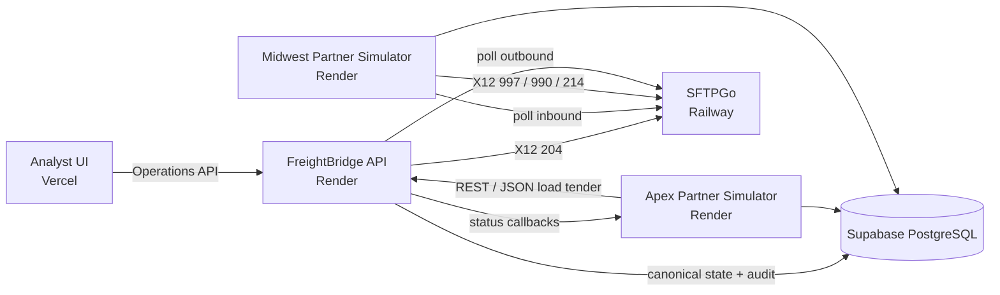

# Deployment Notes

This project is a portfolio lab and is not ready for production traffic. These notes describe the current hosting layout and secret boundaries.

## Current MVP Topology

See the [environment matrix](environment-matrix.md) for runtime inputs and readiness gates.

## Vercel

- Project root: `apps/analyst-ui`
- Build command: `npm run build`
- Output directory: `dist`
- Required environment variables:
  - `VITE_API_BASE_URL`
  - `VITE_APP_ENV`

## Render

- FreightBridge service root: `services/freightbridge-api`
- Apex simulator service root: `services/apex-partner-sim`
- Midwest simulator service root: `services/midwest-partner-sim`
- Build command: `pip install -r requirements.txt`
- Start command: `uvicorn app.main:app --host 0.0.0.0 --port $PORT`
- FreightBridge preferred environment variables:
  - `APP_ENV`
  - `ALLOWED_ORIGINS`
  - `SUPABASE_URL`
  - `SUPABASE_PUBLISHABLE_KEY`
  - `SUPABASE_SECRET_KEY`
  - `DATABASE_URL`
- Legacy names temporarily accepted:
  - `SUPABASE_ANON_KEY`
  - `SUPABASE_SERVICE_ROLE_KEY`
- Health endpoints:
  - `GET /health` checks API liveness only.
  - `GET /readiness` checks configuration and Supabase PostgreSQL connectivity.

Simulator services have their own bearer-token and database settings. Keep simulator tokens and database URLs service-side.

## Supabase

- Supabase hosts PostgreSQL for the deployed synthetic environment.
- Database migrations live under `infrastructure/supabase/migrations`.
- Keep `SUPABASE_SECRET_KEY` and `DATABASE_URL` backend-only.

## Railway

- SFTPGo runs on Railway for the Midwest SFTP exchange.
- Railway public TCP proxying is used for SFTP ingress.
- Required placeholders are documented in `infrastructure/railway/README.md`.

## Final Acceptance

The final MVP deployed gate is [Milestone 22 final acceptance](../testing/milestone-22-final-acceptance.md). It performs deployment preflight checks, invokes the Milestone 20 regression pack, and runs postflight checks without requiring new production variables or direct database access.
