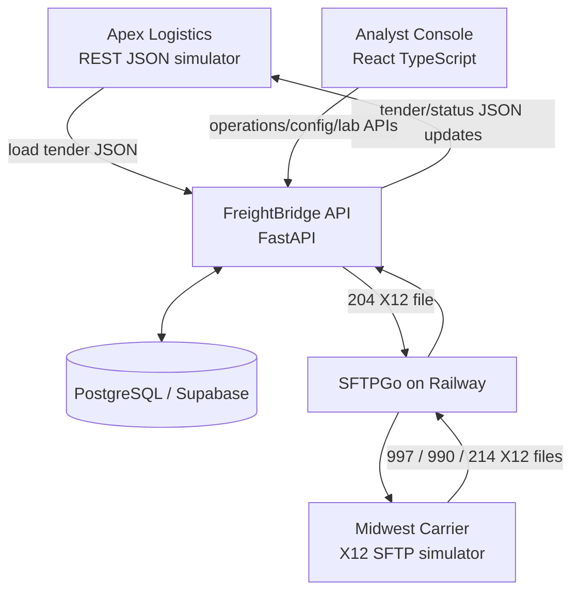

# Portfolio Architecture

FreightBridge is an integration middleware lab between two synthetic partners:

- Apex Logistics: a broker/3PL-style simulator that uses REST/JSON.
- Midwest Carrier: a motor-carrier-style simulator that uses X12 004010 over SFTP.
- FreightBridge: the integration layer that normalizes, maps, audits, transports, and diagnoses messages between them.

## System Context

## Major Components

- `services/freightbridge-api`: FastAPI integration API, canonical domain model, partner mappers, operations APIs, configuration APIs, Integration Lab orchestration, and failure drills.
- `services/apex-partner-sim`: independent synthetic REST/JSON partner simulator.
- `services/midwest-partner-sim`: independent synthetic X12/SFTP carrier simulator.
- `apps/analyst-ui`: protected operations console and Integration Lab UI.
- `infrastructure/supabase/migrations`: PostgreSQL schema and seed migrations.
- `scripts/acceptance`: black-box deployed acceptance harness.
- `scripts/ci`: CI helpers for migration and documentation validation.

## Transport Boundaries

REST/JSON is synchronous and request/response oriented. Apex uses it for load tenders and for receiving tender/status updates.

SFTP is asynchronous and file oriented. FreightBridge writes X12 files to SFTPGo using temporary `.part` files and final rename. Midwest polls inbound files and writes return files to outbound directories. FreightBridge polls, archives successful files, and moves failed files to error handling paths.

## Canonical Model Boundary

FreightBridge maps partner-specific payloads into canonical shipment, tender response, and shipment event concepts. This prevents Apex JSON fields from being directly coupled to Midwest X12 segments.

The canonical model is not presented as a universal logistics standard. It is the project-specific stable boundary that lets FreightBridge hold business state while partner-specific adapters handle contract details.

## Generic X12 Parser Vs Business Mapping

The generic X12 parser handles structure: delimiters, envelopes, segment groups, control numbers, and serialization. It does not know that `AT7*X6` means `IN_TRANSIT` or that `AK1/AK2` correlate a `997` to a `204`.

Partner-specific Midwest modules and mapping configuration handle business meaning:

- `204`: canonical shipment to Midwest load tender.
- `997`: functional acknowledgment for an outbound `204`.
- `990`: business tender response.
- `214`: shipment status event.

This separation keeps parsing reusable while preserving explicit partner profiles.

## Observability Path

FreightBridge records:

- `IntegrationTransaction`: the message or operation being processed.
- `ProcessingLog`: stage-by-stage progress.
- `IntegrationError`: safe error category, code, stage, retryability, and message.
- Mapping audit fields: profile id, profile version, and mapping key.

The Analyst Console surfaces transaction search, transaction detail, failure queue, failure detail, retry actions, and business trace.

## Configuration Path

Partner and mapping configuration is managed through protected operations APIs and the Analyst Console. Mapping profiles are explicit and versioned: draft, validation, activation, archive, and audit history. FreightBridge does not implement arbitrary generic mapping design.

## Testing And Deployment Environment

Normal CI is isolated from deployed infrastructure. It runs unit, contract, integration-style fake-boundary, frontend, documentation, and ephemeral PostgreSQL tests. The database job starts PostgreSQL 16, applies migrations `001` through `011` from scratch, verifies schema/seed data, and runs real repository tests.

Deployed acceptance is manual because it mutates shared synthetic environments. Milestone 20 runs the full Integration Lab happy path and representative controlled failure drills.

## Security Boundaries

Partner credentials and private SFTP material stay server-side. The browser receives only the API URL and app environment label. The operations token is entered at runtime and stored only in session storage. SFTP host-key verification protects the file transport boundary.
