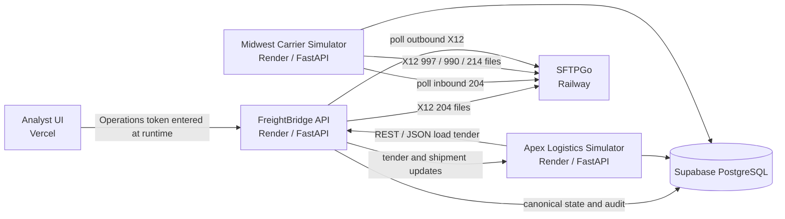

# Final MVP Summary

FreightBridge is a synthetic EDI/API logistics integration portfolio project. It models how a broker-style REST/JSON load tender can be normalized into a canonical shipment, mapped to X12 004010, transported through SFTP, and reconciled through technical acknowledgments, tender decisions, and shipment-status events.

## What The MVP Demonstrates

- REST/JSON ingestion from the synthetic Apex Logistics simulator.
- Canonical shipment, tender, reference, and event state in PostgreSQL.
- Midwest X12 004010 `204`, `997`, `990`, and `214` flows.
- SFTP delivery and polling with archive/error handling.
- Idempotency, duplicate detection, replay metadata, and manual retry support.
- Operational observability through transactions, logs, failure queue, and business trace.
- Versioned partner mapping profiles and configuration change audit.
- Analyst Console workflows for dashboard, transactions, failures, trace, partners, mappings, and Integration Lab.
- Integration Lab happy-path and controlled-failure scenarios for demo and troubleshooting.

## Current Topology

## Acceptance Position

The final MVP acceptance layer is Milestone 22. It first verifies deployed readiness for the three APIs, SFTP transport, operations summary, configuration, mapping profiles, Integration Lab catalog, and Analyst UI. It then invokes the existing Milestone 20 regression pack, which runs the Milestone 18 happy path and Milestone 19 controlled failure drills, and finishes with postflight readiness checks.

## Boundaries

Apex Logistics and Midwest Carrier are fictional/synthetic partners created for this project. FreightBridge is not a production TMS and does not claim real customer usage, production scale, full X12 standard coverage, or real trading partner certification. Deferred items include `210`, AS2/MDN, SOAP/XML third partner behavior, `999`, `TA1`, and production-grade promotion/change-management workflows.
