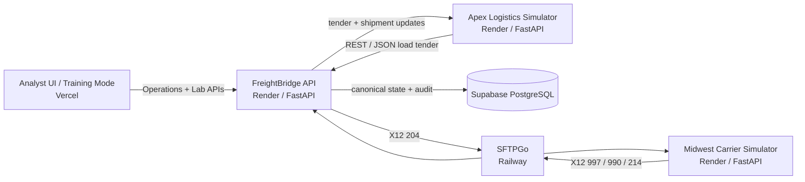

# Final FreightBridge Summary

FreightBridge is a synthetic EDI/API logistics integration and analyst-training platform. It models how a broker-style REST/JSON load tender can be normalized into a canonical shipment, mapped to X12 004010, transported through SFTP, and reconciled through technical acknowledgments, tender decisions, shipment-status events, replay protection, and support workflows.

## Integration Capabilities

- Apex REST/JSON load-tender ingestion with authentication, parsing, contract validation, idempotency, and duplicate detection.
- Canonical shipment, tender, reference, and event state in PostgreSQL.
- Midwest X12 004010 `204`, `997`, `990`, and `214` flows.
- SFTP delivery/polling with host-key pinning, atomic file operations, archive/error routing, and readiness checks.
- Exact X12 replay detection with auditable replay transactions and skipped duplicate side effects.
- Event-time shipment progression so late older events remain in history without regressing current state.
- Apex-facing tender and shipment-status callbacks.
- Versioned partner/mapping configuration and runtime mapping audit metadata.
- Transaction search, business trace, processing logs, failure queue, error detail, retry, and Integration Lab.

## Training Mode

The default authenticated experience is a FreightBridge Ops Desk for the role **Integration Support Analyst**. The completed training path includes:

- First-Day Orientation.
- four-part guided healthy shipment walkthrough.
- Missions 1–10 from healthy-flow fundamentals through the independent Production Incident.
- compact read-only analyst tools inside the workstation.
- Replay & Sequence Clinic before the final shift.
- server-backed recovery evidence for advanced incidents.
- a finished **10 / 10 Training Complete** state with zero pending training incidents.

The final production-style mission uses a valid Midwest 214 that passes transport, parsing, controls, profile compatibility, and status mapping but fails business validation because the B10 shipment reference does not match the intended canonical shipment. Recovery corrects the reference and verifies Apex-facing `PICKED_UP` evidence.

## Current Topology

```mermaid
flowchart LR
  UI[Analyst UI / Training Mode<br/>Vercel]
  FB[FreightBridge API<br/>Render / FastAPI]
  Apex[Apex Logistics Simulator<br/>Render / FastAPI]
  Midwest[Midwest Carrier Simulator<br/>Render / FastAPI]
  DB[(Supabase PostgreSQL)]
  SFTP[SFTPGo<br/>Railway]

  UI -->|Operations + Lab APIs| FB
  Apex -->|REST / JSON load tender| FB
  FB -->|canonical state + audit| DB
  FB -->|X12 204| SFTP
  SFTP --> Midwest
  Midwest -->|X12 997 / 990 / 214| SFTP
  SFTP --> FB
  FB -->|tender + shipment updates| Apex
```

## Quality Position

Normal CI protects:

- frontend lint, tests, coverage, and production build;
- FreightBridge API tests and coverage;
- Apex and Midwest simulator tests;
- contract/X12 regression;
- PostgreSQL migration-chain regression;
- acceptance-harness unit tests;
- documentation validation.

Deployed regression remains intentionally separate because it mutates shared synthetic test data.

## Boundaries

Apex Logistics and Midwest Carrier are fictional partners. FreightBridge is a portfolio lab, not a production TMS, and does not claim real customer traffic, production scale, partner certification, or full X12-standard coverage.

Deferred/future capabilities include `210` Freight Invoice, AS2/MDN, SOAP/XML third-partner behavior, X12 `999`/TA1, and production-grade environment promotion/change management.
